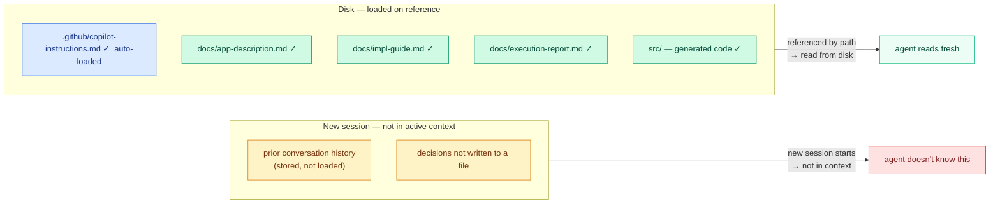

# Design Workflow — Implementation Guide + Agent Execution

> **Scope:** How to design and build a feature using Copilot in agent mode.
> This document describes the three-step workflow, how to iterate on the design,
> and what quality bar each section of the implementation guide must meet.

---

## The Core Principle

Design before code. The implementation guide is the whiteboard — the place where scope,
components, interactions, and contracts are agreed before the agent writes a single line.

This is Rahul Garg's Design-First Collaboration principle, implemented through documents
rather than through a sequential conversation protocol. The output is the same. The
mechanism is different: you build a document iteratively until it's right, then hand it
to the agent for execution.

---

## The Three Steps

```
STEP 1 — Application description
  Input:   The codebase (workspace files)
  Ask:     "Build an md explaining this application."
  Output:  docs/app-description.md
  Purpose: Establishes shared vocabulary before any story work begins.
           The agent reads this in every subsequent step.
           You read it to verify the agent understood correctly.
           Write it once. Update it when the architecture changes significantly.

STEP 2 — Implementation guide
  Input:   The story + docs/app-description.md
  Ask:     "Given the application description in docs/app-description.md and
            this story [paste story], build an implementation guide. The guide
            must be usable as a prompt input and understandable by a human."
  Output:  docs/impl-guide.md
  Purpose: The design document. Contains scope, components, interactions,
           contracts, and constraints. Review it. Iterate until every section
           is correct and clear. This is the authoritative input to Step 3.

STEP 3 — Execution
  Input:   docs/impl-guide.md
  Ask:     "Execute the implementation guide in docs/impl-guide.md. Run the
            tests to verify everything works. Then create a new document
            explaining what you did, any differences from the guide, how to
            run the app, how to run the tests, how to test manually, and
            include a compliant git commit message."
  Output:  Code in the expected locations + docs/execution-report.md
  Purpose: The agent implements against the guide. The execution report is the
           permanent record of what was built, how it deviates from the plan
           (if it does), and everything needed to operate and verify the result.
```

---

## Understanding Sessions

Each Copilot Chat session is a blank slate. The agent has no memory of previous
conversations. Closing a chat and opening a new one starts completely fresh — the
agent does not remember what was discussed, decided, or corrected in prior sessions.



**What persists automatically:** `.github/copilot-instructions.md` only. Copilot
loads this file at the start of every session without being asked. Layers 1 and 2 are
always there. Everything else — the app description, the implementation guide, the
execution report — must be referenced explicitly at the start of each session.

**What this means for the workflow:** The impl-guide and app-description survive session
boundaries not because the agent remembers them, but because they are files on disk.
Reference them by path and the agent reads them fresh. The conversation is ephemeral.
The documents are not. This is why the three-step workflow produces files rather than
relying on conversation history.

**The practical rule:** If a session produces a correction or a decision, write it into
the relevant layer file or impl-guide immediately. Do not rely on the conversation to
carry it forward. The session will end. The file will not.

**Opening a new session mid-story:** When continuing work across days or after a context
reset, start with a one-paragraph brief:

> "We're continuing [STORY-ID]. Read `docs/[STORY-ID]-impl-guide.md` for context.
> Current state: [one sentence — e.g. 'implementation complete, 3 failing tests'].
> Continue from here."

A useful way to think about it: each session is a new expert who knows your project
deeply through the documents you've built, but forgets everything the moment you close
the chat. You are not resuming a conversation. You are briefing a collaborator. The
quality of the session depends on the quality of the briefing. The retrospective question
— "What context were you missing that would have changed your approach?" — is how you
improve the briefing over time.

---

## Step 2 Is Iterative

The implementation guide is not produced in a single pass. Expect two or three iterations.

After the first draft, read every section. For anything that is unclear, technically wrong,
or that you would not be able to explain to a colleague, ask for a rewrite:

> "In impl-guide.md, the components section proposes a [X] — this is unnecessary
> abstraction. Remove it and describe how [Y] handles this directly."

> "The interactions section does not describe what happens when [external call] fails.
> Add the error paths."

Iterate until the guide is correct. Only then proceed to Step 3.

The discipline: **do not execute an implementation guide you could not explain yourself.**
If a section is unclear, the agent will make assumptions. Those assumptions become code.

---

## What a Good Implementation Guide Contains

Garg's Design-First model identifies five dimensions of design, each representing a
different category of decision. A rigorous implementation guide covers all five.

Use these as a review checklist when reading your impl-guide drafts.

### 1 — Scope

What the feature must do, and what it must not do.

**What to check:**
- Every requirement from the story is present
- Explicit exclusions are listed — not implied
- No implementation detail has crept in at this section (no class names, no API paths)
- The scope matches the story — not larger, not smaller

**Common problem:** The agent added capabilities you didn't ask for — caching, analytics
hooks, admin endpoints, rate limiting. If it is not in the story, it does not go in scope.

---

### 2 — Components

The building blocks and their single-line purpose each.

**What to check:**
- Every component has a clear, single responsibility
- Existing components are reused, not duplicated
- No new abstraction wraps something that already works

**Common problem:** Unnecessary abstractions. For every new component proposed, ask:
"What does this do that the underlying dependency doesn't already do?" If the answer
is nothing — remove it.

---

### 3 — Interactions

How the components communicate: data flow, API calls, events, error paths.

**What to check:**
- The flow starts at the correct entry point
- Every component from section 2 appears in the flow
- The flow is direct — no unnecessary hops
- **Error paths are described for every external call**

**Common problem:** Missing error paths. A flow that only describes the happy path
is incomplete. For every external call — database, model, external API — the impl-guide
must state what happens when it fails. If the agent omitted them, ask explicitly:
"Add the error paths for each external call."

---

### 4 — Contracts

Method signatures, types, DTOs, exception classes.

**What to check:**
- Every type is specific — no `Object`, no `Map<String, Object>`
- Exception types are named — not just `throws RuntimeException`
- Signatures follow the project's naming conventions (from Layer 2)
- No method bodies have appeared — signatures only

**Common problem:** Vague types. `List<Object>` or `Map<String, String>` where domain
types should exist. Correct before executing.

---

### 5 — No unrequested additions at execution

This applies to Step 3, not the guide itself. When the agent executes, it may add
features the guide didn't specify — retry logic, caching, metrics endpoints.

Check the execution report against the impl-guide. Anything added that wasn't in scope
goes in a separate story.

---

## The Execution Report

The execution report (`docs/execution-report.md`) is the permanent record of what was
built. It must contain:

- What was implemented and where
- Any deviations from the implementation guide and why
- How to run the application
- How to run the tests
- How to test manually
- A compliant git commit message

This document, together with `docs/impl-guide.md` and `docs/app-description.md`, gives
any engineer — or any future agent session — everything needed to understand, operate,
and continue the work without asking anyone.

---

## The Two-Document Rule

Every story produces exactly two documents. Not more.

### Document 1 — The Implementation Guide

**Created:** Before any code is written.
**Updated:** Iteratively through the design conversation.
**Purpose:** Captures intention — what will be built, why, and how it will work.

This document is built in passes. It starts with scope and components. Each pass adds
detail — interactions, contracts, constraints — until every section is correct and clear.
Only then does execution begin.

**What it contains:**
- Scope: what must be built, what is explicitly out of scope
- Components: building blocks and their single-line purpose
- Interactions: data flow, error paths, external call behavior
- Contracts: method signatures, types, DTOs
- Constraints: decisions already made that this story must respect
- Open questions: resolved before execution, not during

**What it does not contain:** Code snippets, test cases, implementation details.
Those belong in the execution phase.

---

### Document 2 — The Execution Report

**Created:** After execution begins.
**Updated:** Iteratively through development — after each significant phase completes.
**Purpose:** Captures result — what was actually built, how it differs from the plan,
and everything needed to operate and verify it.

This document is the permanent record. It replaces the conversation history. Anyone
who needs to understand, operate, or continue the work reads this document first.

**What it contains:**
- What was implemented and where (file paths, function names)
- Deviations from the implementation guide and why
- How to run the application
- How to run the tests
- How to test manually
- A compliant git commit message
- Review feedback received and how it was addressed

When a PR review comment arrives, the analysis is a prompt exercise — paste the comment,
get the analysis and the fix. The fix goes into the code. The outcome goes into the
execution report under "Review feedback addressed." Not into a separate analysis file.

---

### What Goes in Neither Document

Some content is generated during a story but doesn't belong in either deliverable:

| Content | What to do with it |
|---------|-------------------|
| Codebase research output | Use as prompt context, discard after |
| Architecture spike analysis | Summarize the decision into the impl-guide, discard the spike |
| PR review analysis | Paste as prompt input, commit the fix, record outcome in execution report |
| Confluence summaries | Separate deliverable for stakeholders — not part of this system |

**The test:** If a document isn't the impl-guide or the execution report, ask:
"Who reads this next?" If the answer is "nobody — it was input for a prompt,"
don't save it as a named deliverable.

---

### Why Two and Not More

More documents means more review surface, more maintenance, and more cognitive load
deciding which document to update. The value of the two-document system is that every
decision has exactly one home: intention goes in the impl-guide, result goes in the
execution report.

When the architecture changes mid-implementation, update the impl-guide to reflect the
new decision. Note the old decision with a one-line explanation. The document stays
current. The history is the git diff.

If you find yourself generating more than two named deliverables for a story, stop and
ask which sections of the impl-guide cover the same ground. Accumulation is not
documentation — it is deferred decision-making about what matters.

---

## This Is Context Anchoring

Garg's third pattern — Context Anchoring — describes exactly this: after the design
conversation, capture the decisions in a living document that serves as external memory
across sessions.

> *"The feature document is a living ADR — one that evolves in real-time as decisions
> are made. When the feature ships, significant decisions graduate to formal ADRs."*

The `impl-guide.md` is the feature document. The `execution-report.md` is the ADR in
progress. Together they make the design durable — not dependent on conversation history,
not dependent on the engineer who built it, not dependent on memory.

This is what deletability looks like at the feature level.

---

## Connection to the Layer Structure

The app description and implementation guide connect directly to the context layer
architecture:

| Layer / Level | Document-driven equivalent |
|---------------|---------------------------|
| Layer 0 — codebase analysis | `docs/app-description.md` |
| Layers 1–2 — project conventions | `.github/copilot-instructions.md` (auto-loaded) |
| Garg's design levels 1–4 | Sections of `docs/impl-guide.md` |
| Level 5 — implementation | Agent executes `docs/impl-guide.md` |
| Context Anchoring | `docs/execution-report.md` |

The context layers prime the agent with project knowledge. The implementation guide
provides the task-specific design. The agent executes against both.
