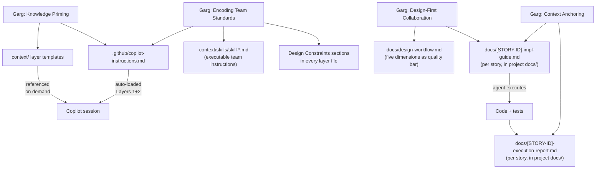
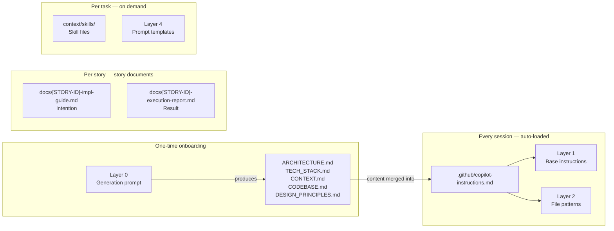
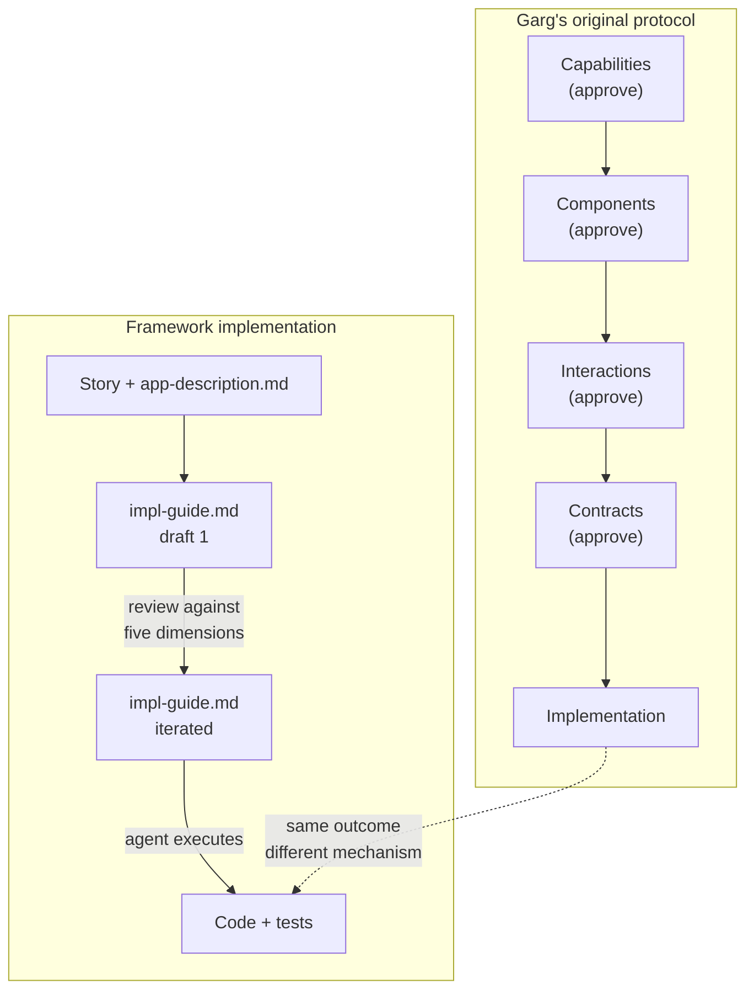
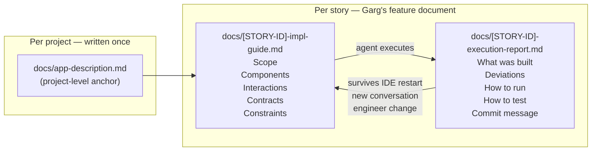
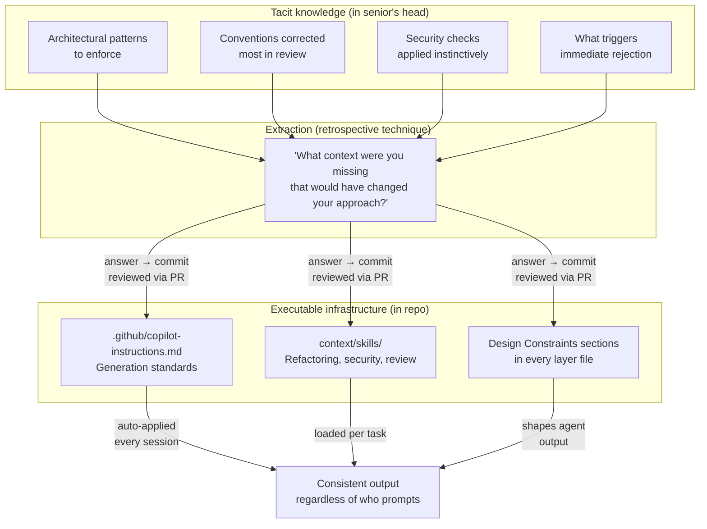
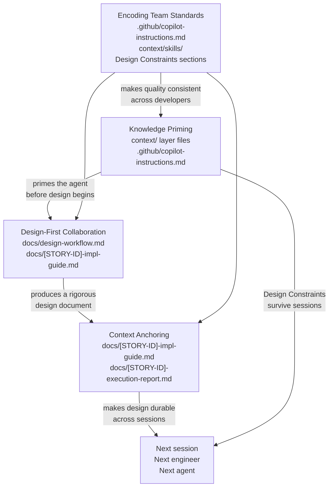

# Garg Patterns → Framework Mapping

This document maps Rahul Garg's four published patterns from martinfowler.com to the
concrete files and mechanisms in this framework. Read it alongside the original articles.

---

## The Four Patterns

Garg published four patterns on martinfowler.com between February and March 2026:

1. **Knowledge Priming** — Prime the AI with project-specific context before any session
2. **Design-First Collaboration** — Structure design thinking in five dimensions before writing code
3. **Context Anchoring** — Preserve design decisions in a living document that persists across sessions
4. **Encoding Team Standards** — Version team judgment as executable instructions shared across all developers

This framework implements all four. The mapping below shows exactly where each concept
lands in the repo.

---

## Overview

---

## Pattern 1 — Knowledge Priming

**Article:** [Knowledge Priming](https://martinfowler.com/articles/reduce-friction-ai/knowledge-priming.html)

**Garg's concept:** Before asking the AI to do anything, give it the project context it
lacks. Stack, conventions, architecture, constraints. Without this, the AI defaults to
generic patterns from training data — the "average of the internet."

**Framework implementation:**

| Garg concept | Framework file | How it works |
|-------------|----------------|--------------|
| Project context | `context/layer-1-base-instructions.md` | Identity, stack, non-negotiables |
| File/naming conventions | `context/layer-2-file-patterns.md` | Structure, naming, canonical patterns |
| Reusable patterns | `context/skills/skill-*.md` | Error handling, testing, logging, configuration |
| Task-specific context | `docs/[STORY-ID]-impl-guide.md` | Per-story scope, components, contracts |
| Auto-loaded context | `.github/copilot-instructions.md` | Layers 1+2 merged, loaded at session start |
| Onboarding shortcut | `context/layer-0-generation-prompt.md` | Generates Layers 1–4 from the codebase |

---

## Pattern 2 — Design-First Collaboration

**Article:** [Design-First Collaboration](https://martinfowler.com/articles/reduce-friction-ai/design-first-collaboration.html)

**Garg's concept:** Structure the design conversation through five progressive dimensions
before writing any code. Each dimension is a different category of decision. Separating
them reduces cognitive load and catches misalignment at the cheapest possible moment.

| Dimension | Question | Output |
|-----------|----------|--------|
| 1 — Capabilities | What does this need to do? | Scope, explicit exclusions |
| 2 — Components | What are the building blocks? | Component list, no code |
| 3 — Interactions | How do they communicate? | Data flow, error paths |
| 4 — Contracts | What are the interfaces? | Signatures, types, DTOs |
| 5 — Implementation | Now write the code | Code against agreed design |

**Framework implementation:**

Garg's original protocol is a sequential conversation gate — explicit approval at each
dimension before proceeding. This framework implements the same five dimensions as a
**quality checklist for the implementation guide** rather than as conversation gates.

| Garg's mechanism | Framework equivalent |
|-----------------|----------------------|
| Sequential dimension conversation | Iterative impl-guide document |
| Dimension approval message | Document review and rewrite cycles |
| Dimensions 1–4 output (in conversation) | Sections of `docs/[STORY-ID]-impl-guide.md` |
| Dimension 5 — agent writes code | Agent executes the impl-guide |

The five dimensions are preserved in `docs/design-workflow.md` as a review checklist:
when reading the impl-guide draft, each dimension tells you what to look for and what
common problem to catch.

**What's the same:** Design precedes code. All five dimensions must be covered. The
quality bar for each dimension is identical.

**What's different:** The framework collapses the five sequential checkpoints into one
document reviewed iteratively. The document serves as both the design record and the
execution input.

---

## Pattern 3 — Context Anchoring

**Article:** [Context Anchoring](https://martinfowler.com/articles/reduce-friction-ai/context-anchoring.html)

**Garg's concept:** AI sessions are ephemeral — decisions made early in a conversation
lose attention as it lengthens, and vanish entirely when the session ends. Context
Anchoring externalises design decisions into a living document that persists across
sessions and can be read by the next engineer or the next agent without any history.

**Framework implementation:**

| Garg concept | Framework equivalent |
|-------------|----------------------|
| Feature document (decisions + reasoning) | `docs/[STORY-ID]-impl-guide.md` |
| Current constraints the AI must respect | Design Constraints sections in layer files |
| Open questions | `docs/[STORY-ID]-impl-guide.md` open questions section |
| What was done vs what remains | `docs/[STORY-ID]-execution-report.md` |
| Living ADR in progress | impl-guide + execution-report together |

---

## Pattern 4 — Encoding Team Standards

**Article:** [Encoding Team Standards](https://martinfowler.com/articles/reduce-friction-ai/encoding-team-standards.html)

**Garg's concept:** Patterns 1–3 solve the individual developer problem. Pattern 4 solves
a different one: two developers on the same team, same codebase, same tool, producing
different quality because the senior's judgment lives in her head, not in shared
infrastructure. The solution is to encode that judgment as versioned AI instructions —
reviewed through pull requests, shared by default, applied consistently regardless of who
is prompting.

Garg identifies two moves. First: from tacit to explicit — extract the senior's instincts
into written rules. Second: from documentation to execution — put those rules where the AI
executes them, not where humans might read them. The result is what he calls executable
governance: the team's quality bar is applied as a side effect of the workflow.

**Framework implementation:**

| Garg concept | Framework file | How it works |
|-------------|----------------|--------------|
| Generation instruction | `.github/copilot-instructions.md` + Layers 1–2 | Project-wide constraints auto-applied every session |
| Reusable instruction sets | `context/skills/skill-*.md` | Per-concern instructions for error handling, testing, logging, configuration, refactoring, security, review |
| Categorized standards (must/should/nice) | Design Constraints sections in every layer file | Explicit "Do not..." rules — the team's priority tiers made concrete |
| Extraction process | Retrospective technique | "What context were you missing?" surfaces tacit knowledge after each task |
| Versioned shared artifact | Repo + PR review | All layer files and skill files change through pull requests, not individual preference |

**What Garg describes as the four instruction types:**

| Instruction type | Purpose | Framework location |
|-----------------|---------|-------------------|
| Generation | Encode how the team builds new code | Layers 1–2 in `.github/copilot-instructions.md` |
| Refactoring | Encode how the team improves existing code | `context/skills/skill-refactoring.md` |
| Security | Encode the team's threat model | `context/skills/skill-security-review.md` |
| Review | Encode the team's quality gate | `context/skills/skill-code-review.md` |

**Anatomy of an executable instruction** (applies to all four types):

| Element | Purpose |
|---------|---------|
| Role definition | Sets expertise level and perspective — the lens through which everything else applies |
| Context requirements | What must be present before the instruction operates — makes dependencies explicit |
| Categorized standards | Priority tiers (must / should / nice to have) — encodes judgment, not just knowledge |
| Output format | Structured response with summary, categorized findings, clear next steps |

**What's the same as Garg's article:** Standards encoded as AI instructions. Four instruction
types (generation, refactoring, security, review). Versioned in the repository, reviewed
through pull requests. The retrospective technique as the extraction mechanism.

**What's different:** Garg describes creating these instructions from scratch via extraction
interviews. This framework generates Layers 1–2 from the codebase (Layer 0 prompt) and
grows the constraints through the retrospective technique after each task. The interview
is replaced by accumulated practice.

---

## How the Four Patterns Compose

Knowledge Priming eliminates the cold-start problem. Design-First eliminates the
implementation trap. Context Anchoring eliminates the amnesia problem. Encoding Team
Standards eliminates the consistency problem — the gap between what the senior produces
and what everyone else produces. None of the four works as well without the other three.

---

## What the Framework Adds Beyond the Articles

| Framework addition | Why it exists |
|-------------------|---------------|
| Layer 0 generation prompt | Garg describes manual authoring. Layer 0 generates Layers 1–4 from the codebase in one session |
| `docs/app-description.md` | Project-level anchor document — Knowledge Priming at the session level |
| Two-document rule | Every story produces exactly two documents — impl-guide (intention) and execution-report (result) |
| `context/skills/` folder | Reusable, stack-agnostic instruction sets — Garg's four instruction types made available as shared library files |

---

## Reading Order

1. [Knowledge Priming](https://martinfowler.com/articles/reduce-friction-ai/knowledge-priming.html) — understand why context loading matters
2. `context/README.md` — see how the framework implements it
3. [Design-First Collaboration](https://martinfowler.com/articles/reduce-friction-ai/design-first-collaboration.html) — understand the five dimensions
4. `docs/design-workflow.md` — see how the framework implements it
5. [Context Anchoring](https://martinfowler.com/articles/reduce-friction-ai/context-anchoring.html) — understand why decisions need to be written down
6. `docs/copilot-context-model.md` — understand how the agent reads files across sessions
7. [Encoding Team Standards](https://martinfowler.com/articles/reduce-friction-ai/encoding-team-standards.html) — understand why individual practice is not enough
8. `context/layer-3-skills.md` + `context/skills/` — see how team standards are encoded as executable instructions
