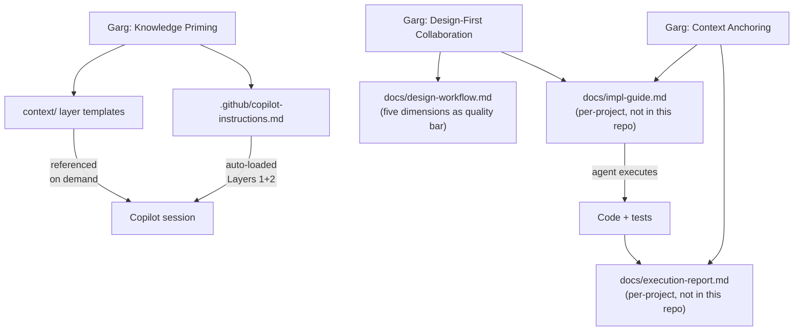
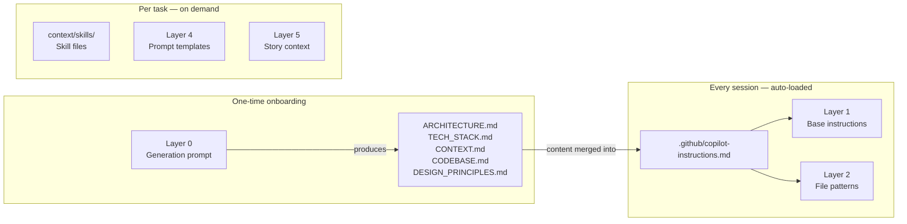
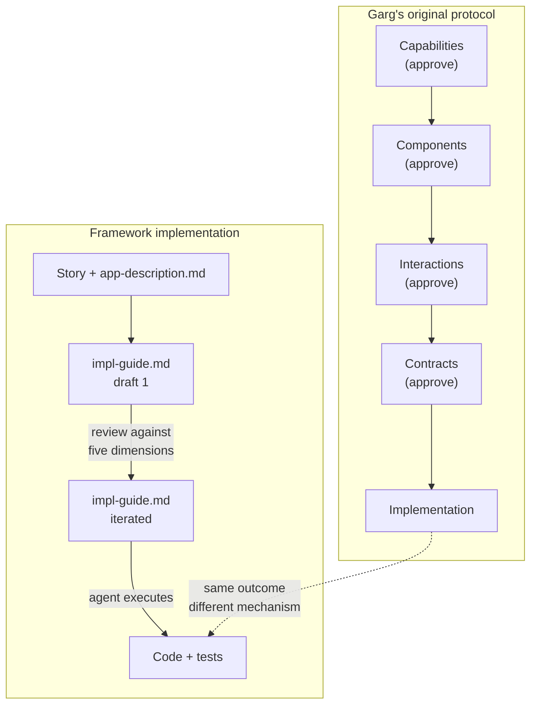
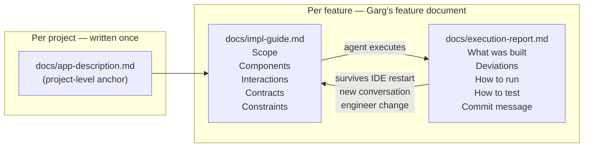
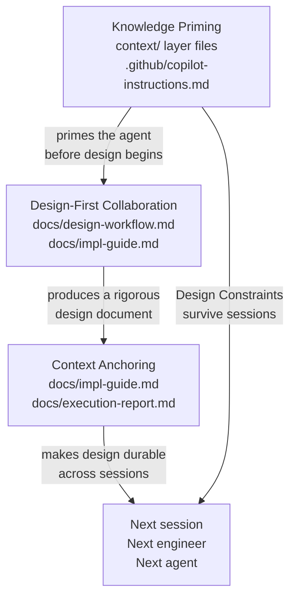

# Garg Patterns → Framework Mapping

This document maps Rahul Garg's three published patterns from martinfowler.com to the
concrete files and mechanisms in this framework. Read it alongside the original articles.

---

## The Three Patterns

Garg published three patterns on martinfowler.com between February and March 2026:

1. **Knowledge Priming** — Prime the AI with project-specific context before any session
2. **Design-First Collaboration** — Structure design thinking in five dimensions before writing code
3. **Context Anchoring** — Preserve design decisions in a living document that persists across sessions

This framework implements all three. The mapping below shows exactly where each concept
lands in the repo.

---

## Overview

---

## Pattern 1 — Knowledge Priming

**Article:** [Knowledge Priming](https://martinfowler.com/articles/reduce-friction-ai/knowledge-priming.html)

**Garg's concept:** Before asking the AI to do anything, give it the project context it
lacks. Stack, conventions, architecture, constraints. Without this, the AI defaults to
generic patterns from training data — the "average of the internet."

**Framework implementation:**

| Garg concept | Framework file | How it works |
|-------------|----------------|--------------|
| Project context | `context/layer-1-base-instructions.md` | Identity, stack, non-negotiables |
| File/naming conventions | `context/layer-2-file-patterns.md` | Structure, naming, canonical patterns |
| Reusable patterns | `context/skills/skill-*.md` | Error handling, testing, logging, configuration |
| Task-specific context | `context/layer-5-story-context.md` | Per-story scope and constraints |
| Auto-loaded context | `.github/copilot-instructions.md` | Layers 1+2 merged, loaded at session start |
| Onboarding shortcut | `context/layer-0-generation-prompt.md` | Generates Layers 1–4 from the codebase |

**The Design Constraints principle** (framework addition, not in the article):
Garg describes loading context. The framework adds a specific mechanism for making that
context shape output rather than merely inform it: every layer file has a "Design
constraints" section with explicit "Do not..." rules. Weak priming informs. Strong
priming constrains.

---

## Pattern 2 — Design-First Collaboration

**Article:** [Design-First Collaboration](https://martinfowler.com/articles/reduce-friction-ai/design-first-collaboration.html)

**Garg's concept:** Structure the design conversation through five progressive dimensions
before writing any code. Each dimension is a different category of decision. Separating
them reduces cognitive load and catches misalignment at the cheapest possible moment.

| Dimension | Question | Output |
|-----------|----------|--------|
| 1 — Capabilities | What does this need to do? | Scope, explicit exclusions |
| 2 — Components | What are the building blocks? | Component list, no code |
| 3 — Interactions | How do they communicate? | Data flow, error paths |
| 4 — Contracts | What are the interfaces? | Signatures, types, DTOs |
| 5 — Implementation | Now write the code | Code against agreed design |

**Framework implementation:**

Garg's original protocol is a sequential conversation gate — explicit approval at each
dimension before proceeding. This framework implements the same five dimensions as a
**quality checklist for the implementation guide** rather than as conversation gates.

| Garg's mechanism | Framework equivalent |
|-----------------|----------------------|
| Sequential dimension conversation | Iterative impl-guide document |
| Dimension approval message | Document review and rewrite cycles |
| Dimensions 1–4 output (in conversation) | Sections of `docs/impl-guide.md` |
| Dimension 5 — agent writes code | Agent executes `docs/impl-guide.md` |

The five dimensions are preserved in `docs/design-workflow.md` as a review checklist:
when reading the impl-guide draft, each dimension tells you what to look for and what
common problem to catch.

**What's the same:** Design precedes code. All five dimensions must be covered. The
quality bar for each dimension is identical.

**What's different:** The framework collapses the five sequential checkpoints into one
document reviewed iteratively. The document serves as both the design record and the
execution input.

---

## Pattern 3 — Context Anchoring

**Article:** [Context Anchoring](https://martinfowler.com/articles/reduce-friction-ai/context-anchoring.html)

**Garg's concept:** AI sessions are ephemeral — decisions made early in a conversation
lose attention as it lengthens, and vanish entirely when the session ends. Context
Anchoring externalises design decisions into a living document that persists across
sessions and can be read by the next engineer or the next agent without any history.

**Framework implementation:**

| Garg concept | Framework equivalent |
|-------------|----------------------|
| Feature document (decisions + reasoning) | `docs/impl-guide.md` |
| Current constraints the AI must respect | Design Constraints sections in layer files |
| Open questions | `docs/impl-guide.md` open questions section |
| What was done vs what remains | `docs/execution-report.md` |
| Living ADR in progress | `docs/impl-guide.md` + `docs/execution-report.md` together |

---

## How the Three Patterns Compose

Knowledge Priming eliminates the cold-start problem. Design-First eliminates the
implementation trap. Context Anchoring eliminates the amnesia problem. None of the three
works as well without the other two.

---

## What the Framework Adds Beyond the Articles

| Framework addition | Why it exists |
|-------------------|---------------|
| Layer 0 generation prompt | Garg describes manual authoring. Layer 0 generates Layers 1–4 from the codebase in one session |
| Design Constraints sections in every layer file | Makes context files shape output rather than merely inform it |
| `context/skills/` folder | Reusable, stack-agnostic skill files — error handling, testing, logging, configuration — loadable per task |
| Retrospective technique ("What context were you missing?") | Feedback loop for improving layer files over time — not in any article |
| `docs/app-description.md` | Project-level anchor document analogous to Knowledge Priming but at the agent session level |
| `docs/execution-report.md` | Extends Context Anchoring beyond the design phase into the execution record |

---

## Reading Order

1. [Knowledge Priming](https://martinfowler.com/articles/reduce-friction-ai/knowledge-priming.html) — understand why context loading matters
2. `context/README.md` — see how the framework implements it
3. [Design-First Collaboration](https://martinfowler.com/articles/reduce-friction-ai/design-first-collaboration.html) — understand the five dimensions
4. `docs/design-workflow.md` — see how the framework implements it
5. [Context Anchoring](https://martinfowler.com/articles/reduce-friction-ai/context-anchoring.html) — understand why decisions need to be written down
6. `docs/copilot-context-model.md` — understand how the agent reads files across sessions
